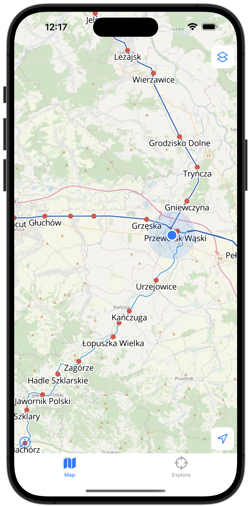

# RailwayMap
World railway map iOS app avaible <a href="https://apps.apple.com/app/railway-map/id6502848187">https://apps.apple.com/app/railway-map/id6502848187</a>  
 
RailwayMap uses SwiftUI and MapLibre Native. 
Railway tracks and stations on the map are draws using .mbtiles created by tilemaker and are available offline. 

&nbsp;
 
 
&nbsp;
 